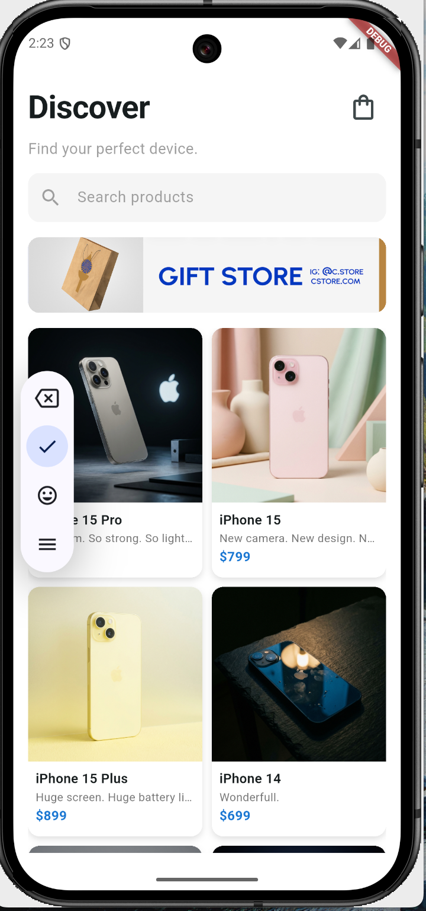
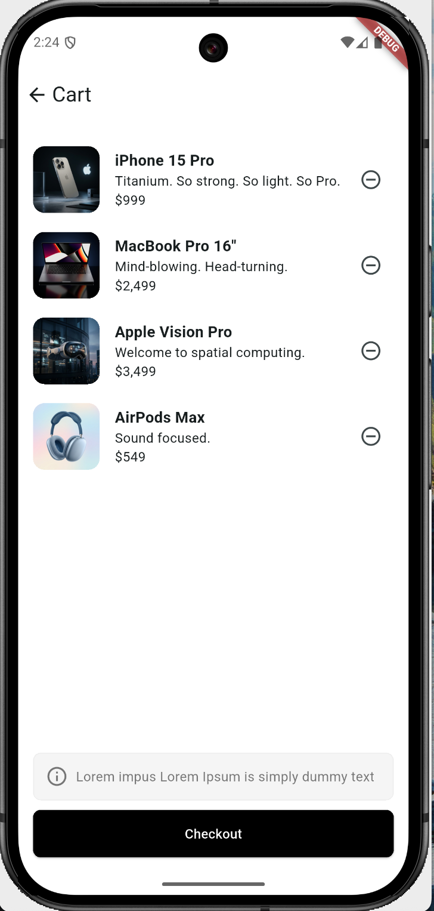
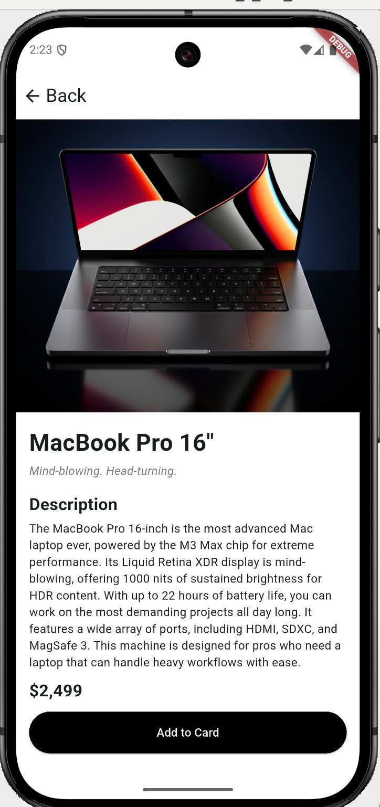

# katalog_app

Flutter ile geliştirilmiş bir ürün katalog uygulaması.

## Açıklama
Bu proje bir **Mini Katalog Uygulaması**dır. Kullanıcılar uygulamayı açtığında ürünleri görebilir, ürün detayına geçebilir ve basit state güncellemelerini görebilir.

### Öne Çıkan Özellikler
- Ana sayfa – ürün listesi  
- Ürün detayı ekranı  
- Sepet özelliği – ürünleri sepete ekleme ve yönetme  
- Sayfa geçişleri (Navigator)  
- Route Arguments kullanımı  
- GridView ile kart tabanlı tasarım  
- Basit state güncelleme örneği

## Kullanılan Flutter Sürümü

```bash```
Flutter 3.41.4 • channel stable
Dart 3.11.1
DevTools 2.54.1

## Çalıştırma Adımları

# 1. Projeyi klonlayın
git clone https://github.com/cansuozdmrdev/katalog_app.git

# 2. Proje dizinine gidin
cd katalog_app

# 3. Paketleri yükleyin
flutter pub get

# 4. Uygulamayı çalıştırın
flutter run

Not: Uygulamayı çalıştırmak için bağlı bir cihaz veya emulator gereklidir.


## Ekran Görüntüleri
### Ana Sayfa


### Sepet


### Ürün Detayı

